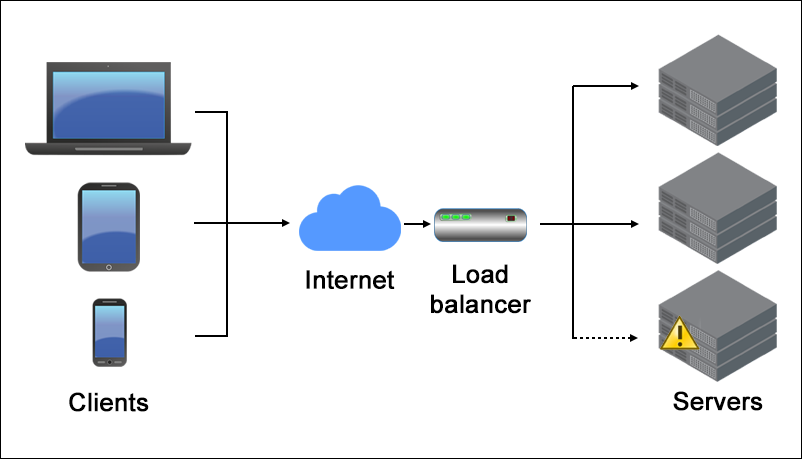

# Load Balancer with Express.js

This project demonstrates a simple load balancer implemented using Node.js and Express. It includes a load balancer that can distribute requests to multiple backend servers using either round-robin or random selection strategies.



---

## Project Structure

- `loadbalancer.js`: Implements the load balancer.
- `servers.js`: Spawns multiple backend servers for testing.

---

## Getting Started

### Prerequisites
- Node.js (v14+ recommended)

### Installation
No installation is required. Simply run the scripts with Node.js.

---

## Usage

### 1. Start the Backend Servers

```bash
node servers.js <startPort> <serverCount>
````

* `startPort`: Starting port number (default: `3000`)
* `serverCount`: Number of servers to spin up (default: `1`)

Example:

```bash
node servers.js 3000 3
```

This will start servers on ports 3000, 3001, and 3002.

### 2. Start the Load Balancer

```bash
node loadbalancer.js <startPort> <serverCount>
```

* `startPort`: Must match the `startPort` used when starting the servers (default: `4012`)
* `serverCount`: Must match the number of servers you started (default: `3`)

Example:

```bash
node loadbalancer.js 3000 3
```

This will proxy incoming requests to servers on ports 3000, 3001, and 3002.

### 3. Send Requests

Open your browser and navigate to:

```
http://localhost:5001
```

This will route the request to one of the backend servers using **random selection**.

---

## Load Balancing Strategies

### Round Robin (Defined but not currently used)

Cycles through the list of servers sequentially.

```js
app.get("/", roundRobinLoadBalancer);
```

### Random (Default)

Selects a server randomly for each request.

```js
app.get("/", randomLoadBalancer);
```

To switch strategies, comment/uncomment the appropriate line in `loadbalancer.js`.

---

## Graceful Shutdown

Press `0` in the terminal to stop the server gracefully.

---

## License

This project is for educational purposes only.

```
```
