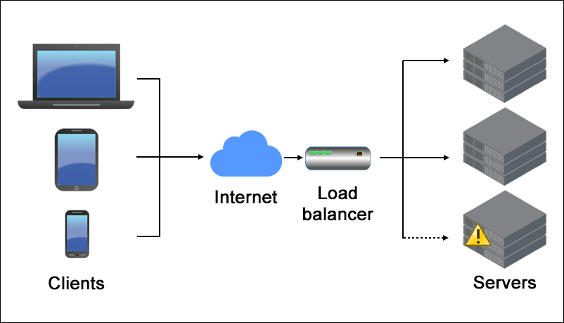

# Load Balancer with Express.js

This project demonstrates a simple load balancer implemented using Node.js and Express. The load balancer distributes incoming requests to multiple backend servers using either round-robin or random selection strategies. It also includes a basic rate limiter to prevent abuse.



---

## Project Structure

- `loadbalancer.js`: Main load balancer server. Proxies requests to backend servers using a load balancing algorithm and applies rate limiting.
- `server.js`: Spawns multiple backend servers for testing.
- `loadbalancing-algorithms.js`: Contains the round-robin and random load balancing middleware.
- `rate-limiter.js`: Implements a simple in-memory rate limiter middleware.

---

## Getting Started

### Prerequisites
- Node.js (v14+ recommended)

### Installation
No installation is required. Simply run the scripts with Node.js.

---

## Usage

### 1. Start the Backend Servers

```bash
node server.js <startPort> <serverCount>
```

- `startPort`: Starting port number (default: `3000`)
- `serverCount`: Number of servers to spin up (default: `1`)

Example:

```bash
node server.js 3000 3
```

This will start servers on ports 3000, 3001, and 3002.

### 2. Start the Load Balancer

```bash
node loadbalancer.js <startPort> <serverCount>
```

- `startPort`: Must match the `startPort` used when starting the servers (default: `4012`)
- `serverCount`: Must match the number of servers you started (default: `3`)

Example:

```bash
node loadbalancer.js 3000 3
```

This will proxy incoming requests to servers on ports 3000, 3001, and 3002.

### 3. Send Requests

Open your browser and navigate to:

```
http://localhost:5001
```

This will route the request to one of the backend servers using the **round-robin** strategy by default.

---

## Features

### Load Balancing Strategies

- **Round Robin (Default):**  
  Cycles through the list of servers sequentially for each request.

- **Random:**  
  Selects a server randomly for each request.

To switch strategies, update the following line in `loadbalancer.js`:

```js
// For round robin (default)
app.get("/", rateLimiter, roundRobinLoadBalancer(servers));

// For random (uncomment and comment out the above)
const { randomLoadBalancer } = require("./loadbalancing-algorithms");
app.get("/", rateLimiter, randomLoadBalancer(servers));
```

### Rate Limiting

- Each client IP is limited to 5 requests per minute.
- If the limit is exceeded, the client receives a `429 Too Many Requests` response.

---

## Graceful Shutdown

Press `0` in the terminal running either the load balancer or any backend server to stop it gracefully.

---

## License

This project is for educational purposes only.